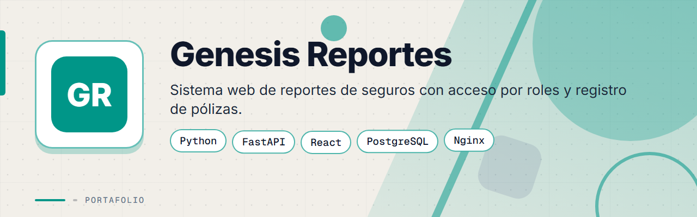
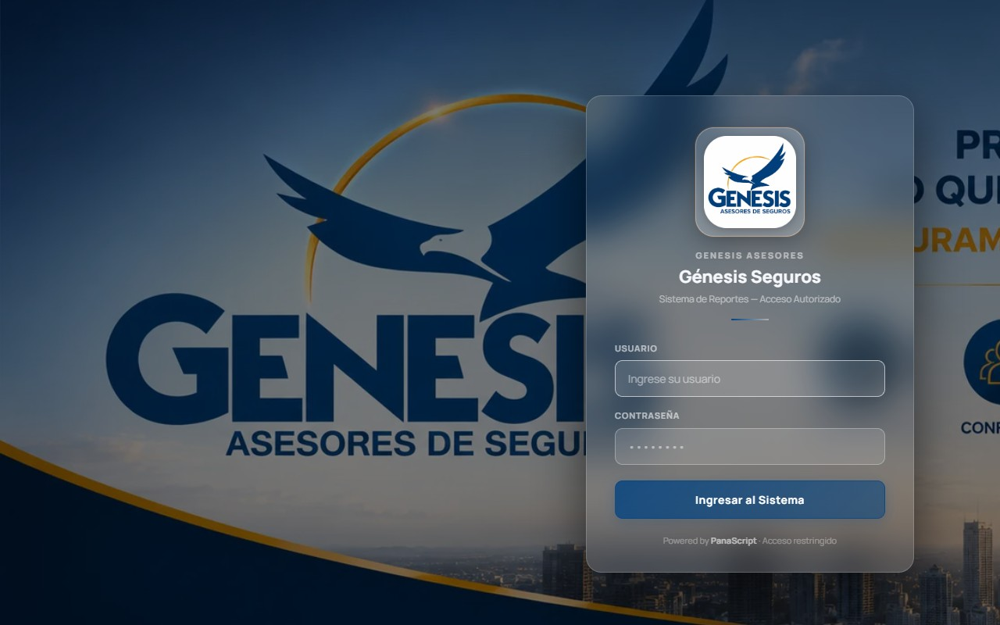
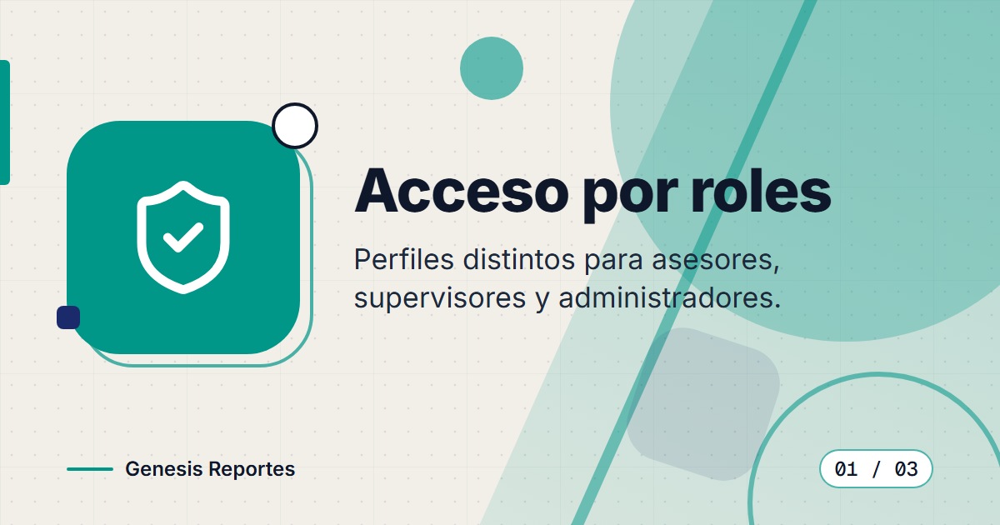
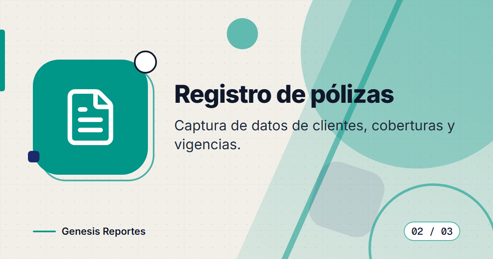
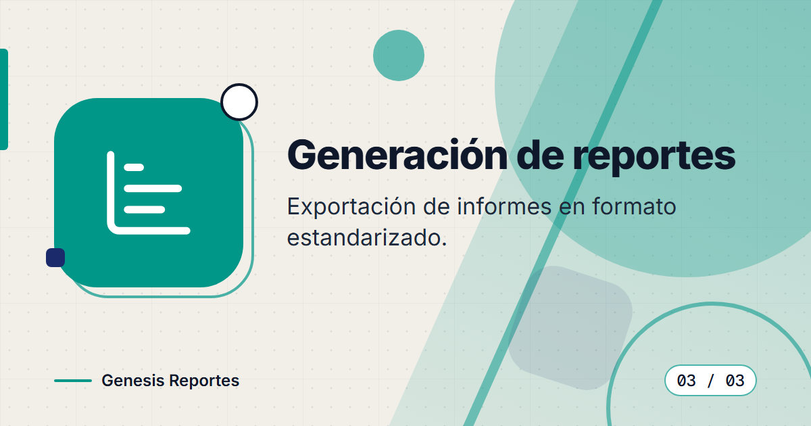
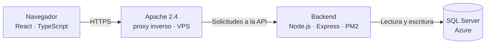

# Genesis: Sistema de Reportes

**Sistema web para la gestión y generación de reportes de seguros de Genesis Asesores de Seguros, con acceso por roles, registro de pólizas y exportación de informes.**

**[Ver el sistema en producción](https://genesis-somos.ddns.net/)** (acceso autorizado)

> Este es un **portafolio showcase**: el código fuente es propietario y no está incluido.

---

## Contenido

- [El Problema](#el-problema)
- [La Solución](#la-solución)
- [Funcionalidades](#funcionalidades)
- [Vista Previa](#vista-previa)
- [Arquitectura](#arquitectura)
- [Stack Tecnológico](#stack-tecnológico)
- [Instalación local](#instalación-local)
- [Roadmap](#roadmap)
- [Contacto](#contacto)

---

## El Problema

Una firma de asesores de seguros en Panamá necesitaba una plataforma interna para:

- Registrar y consultar pólizas de clientes de forma centralizada.
- Generar reportes de seguros en formato estandarizado.
- Controlar el acceso por roles: asesores, supervisores y administradores.
- Eliminar la dependencia de hojas de cálculo para el seguimiento de cartera.

---

## La Solución

Genesis es un sistema web de acceso restringido que permite a los asesores registrar información de pólizas, generar reportes formateados y consultarlos desde cualquier dispositivo con credenciales autorizadas.

---

## Funcionalidades

| Funcionalidad | Descripción |
|---------------|-------------|
| Autenticación por roles | Acceso diferenciado para asesores, supervisores y administradores |
| Registro de pólizas | Captura de datos de clientes, coberturas y vigencias |
| Generación de reportes | Exportación de informes en formato estandarizado |
| Historial de asegurados | Consulta rápida del historial de pólizas por cliente |
| Panel administrativo | Gestión de usuarios y configuración del sistema |

---

## Vista Previa

<table>
  <tr>
    <td width="50%">
      
       <b>Inicio de sesión</b>: acceso restringido con usuario y contraseña.
    </td>
    <td width="50%">
      
       <b>Acceso por roles</b>: perfiles distintos para asesores, supervisores y administradores.
    </td>
  </tr>
  <tr>
    <td width="50%">
      
       <b>Registro de pólizas</b>: captura de datos de clientes, coberturas y vigencias.
    </td>
    <td width="50%">
      
       <b>Generación de reportes</b>: exportación de informes en formato estandarizado.
    </td>
  </tr>
</table>

> Sistema de acceso restringido. Capturas adicionales del panel disponibles bajo solicitud.

---

## Arquitectura

El acceso se controla por roles (asesor, supervisor y administrador), de modo que cada perfil ve y gestiona solo lo que le corresponde.

---

## Stack Tecnológico

| Capa | Tecnología |
|------|-----------|
| Frontend | React 19 · TypeScript · Vite · Tailwind CSS 4 · motion · lucide-react |
| Backend | Node.js · Express 4 · express-session (cookies HTTP-only) · bcryptjs · helmet · express-rate-limit |
| Base de datos | SQL Server en Azure (driver mssql, sin ORM, scripts T-SQL) |
| Pruebas | Vitest + Testing Library (frontend) · Jest + supertest (backend) |
| Despliegue | PM2 en VPS Linux · proxy inverso Apache 2.4 |

---

## Instalación local

> **Aviso:** el código es privado y propietario. Estos pasos son solo orientativos para colaboradores autorizados con acceso al repositorio.

1. Instala Node.js.
2. Instala las dependencias del backend y del frontend.
3. Configura tus propias variables de entorno (conexión a SQL Server y credenciales).
4. Inicia el backend Express y el entorno de desarrollo de Vite (React).

---

## Roadmap

- [ ] Ampliar la variedad de formatos de exportación de informes.
- [ ] Agregar más indicadores al panel administrativo.
- [ ] Publicar capturas del panel con datos de demostración.

---

## Contacto

El código fuente es propietario. Para consultas o propuestas, escríbeme:

[%206517--1870-25D366?style=for-the-badge&logo=whatsapp&logoColor=white)](https://wa.me/50765171870)

- Correo: [pablozam1931@gmail.com](mailto:pablozam1931@gmail.com)
- WhatsApp: [(507) 6517-1870](https://wa.me/50765171870)
- GitHub: [github.com/deadlyrat](https://github.com/deadlyrat)

---

*Parte del portafolio de [deadlyrat](https://github.com/deadlyrat)*
